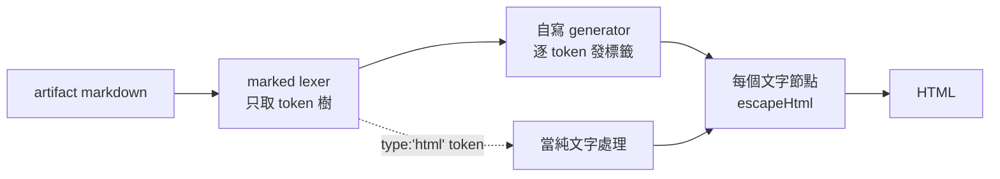
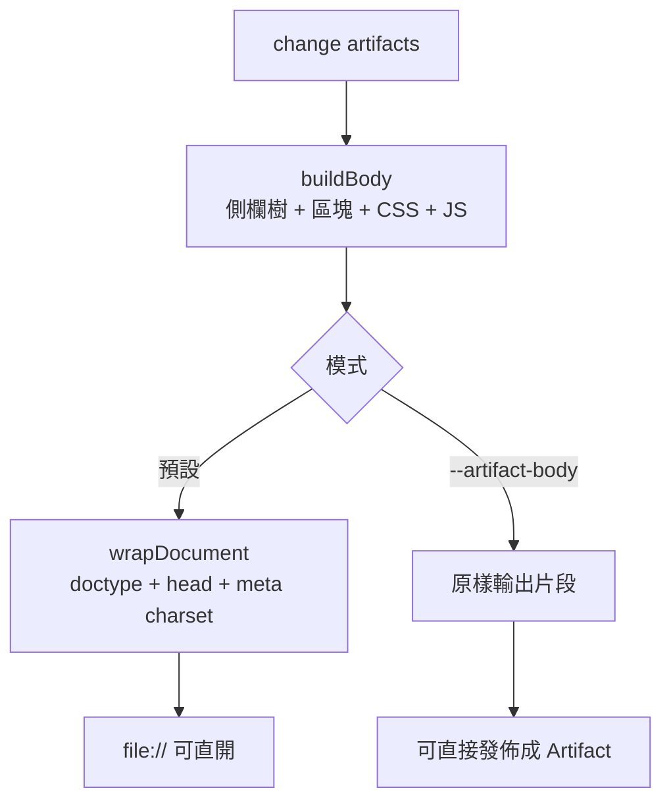

# html-viewer-markdown-artifact-mode — Design

## Context

`src/core/render/html.ts` 的 `renderMarkdownRaw()` 現況只做兩件事：

```
markdown ──splitMermaidSegments──┬─ mermaid 段 → <pre class="mermaid">escape(內容)</pre>
                                 └─ 其餘      → <pre class="spec-raw">escape(內容)</pre>
```

`<pre class="mermaid">` 是為 **Artifact 平台**留的 hook（平台原生渲染 mermaid）；其餘 markdown 從未被轉換。實機截圖確認：design.md 的表格是 pipe 字串、`**Goals:**` 露出星號。

同時交付方式改變：使用者要 link 不要 filesystem 路徑。這撞上一個既有約束的**方向性衝突**：

| 情境 | 外殼要求 | 來源 |
|------|---------|------|
| `file://` 直開 | **必須**完整文件（`<meta charset>` 否則 CJK 亂碼） | 既有 requirement「產出單檔自足」 |
| Artifact 發佈 | **必須無**外殼（平台自己包 doctype/head/body） | 發佈平台契約 |

兩者不可能同時滿足於同一份輸出 → 需要兩種輸出模式。

現有 renderer 的核心原則（change `add-openspec-html-command` 建立，memory `feedback-secure-by-construction-over-scanning` 教訓一背書）：**固定模板 + 每個動態值強制跳脫，不安全輸出沒有產生路徑，不做產出後掃描**。本 change MUST 不破壞它。

## Goals / Non-Goals

**Goals:**
- design.md 的表格、清單、粗體真的被渲染。
- 產出可直接發佈成 Artifact 的無外殼片段，使交付變成「一個 link」。
- secure-by-construction 不退步：新增結構仍由我們自己發，文字節點與屬性全跳脫。
- 預設模式行為零回歸（`file://` 直開仍完整可用）。

**Non-Goals:**
- 不做 CommonMark／GFM 完整相容、不支援 HTML 透傳。
- **不內嵌 mermaid runtime**（交付改走平台後不需要——見 Decision 3）。
- 不由 CLI 執行發佈（CLI 產片段，發佈是呼叫端的事）。
- 不改既有 `--out`／`--open`／落點政策。

## Decisions

### Decision 1: 借 parser 的 token stream，HTML 全部自己發
**Covers**: `html-viewer-command`



用 `marked` 的 **lexer** 只做 tokenize，得到結構化 token 樹；HTML 由本 repo 的 generator 逐 token 發出，每個文字節點過 `escapeHtml`、每個屬性值過跳脫 + allowlist。**從不輸出 parser 產生的 HTML 字串。**

**Rationale**：markdown 邊界（嵌套清單縮排、表格對齊列、fence 內的 fence）自寫極易出錯；但「誰負責 escape」必須留在我們手上。這個切法兩者兼得——parser 只回答「這是什麼結構」，不參與「輸出什麼字元」。

**Rejected**：
- **`marked.parse()` 產 HTML + sanitizer** — 正是 memory 教訓一被打穿四輪的反模式（產生不安全輸出再掃描）；且 Node 端 sanitize 還要拖 jsdom。
- **完全自寫 tokenizer（零依賴）** — 把最易錯的部分搬到自己身上，收益（省一個依賴）不成比例。
- **`markdown-it` 自訂 renderer rules** — 預設 renderer 會 fallback 輸出 HTML，漏改一條 rule 就破防；`marked` 的 lexer/parser 分離更契合「只要 token」。

**Directive（給未來修改者）**：新增支援語法時一律加在 generator 的 switch 上並補對抗性測試；**永遠不要**把 token 的 `raw`／`text` 當 HTML 直接輸出。

### Decision 2: 兩種輸出模式，共用同一個內容產生器
**Covers**: `html-viewer-command`



內容產生器（`buildBody`）產出「片段」；預設模式再套一層 `wrapDocument`。CSS／JS 一律放在片段內（`<style>`／`<script>` 就在內容裡），不放 `<head>`。

**Rationale**：兩模式差異壓縮成「有沒有套外殼」一個分支，內容邏輯零分岔——避免「片段模式少了某個 CSS」這類只在一條路徑出現的 bug。把 style/script 放片段內是必要條件（片段沒有 `<head>` 可用）。

**Rejected**：
- **兩份獨立模板** — 必然漂移，兩倍維護面。
- **發佈時由呼叫端剝殼**（regex 拿掉 doctype/html/head/body）— 脆弱、且把「什麼算外殼」的知識散到呼叫端；CLI 自己知道最準。
- **一律產無外殼、放棄 file://** — 既有 requirement 明文要求完整文件與 charset，且離線 fallback 有實際價值（不想外送內容時）。

### Decision 3: 不內嵌 mermaid runtime
**Covers**: `html-viewer-command`

mermaid 區塊維持 `<pre class="mermaid">`（跳脫文字）。artifact 模式由平台原生渲染；預設模式維持文字區塊。

**Rationale**：交付改走 Artifact 後，內嵌 runtime 的唯一用途只剩「本機 fallback 也要看到圖」——代價是新增 mermaid 依賴、產出檔漲到 MB 級，且會引入本 renderer 前所未有的性質：**不可信 artifact 文字被第三方 runtime 當圖語言解析**（mermaid 歷來有 label XSS）。用平台原生渲染換掉這整片攻擊面與體積，是明顯划算的。

**Rejected**：
- **內嵌 mermaid.min.js**（本 change 早期方案，使用者先前選定）— 交付改走 link 後前提消失；保留它等於為 fallback 情境付全額成本。
- **產生時預轉 SVG（mermaid-cli）** — 外部工具版本影響輸出、破壞既有 byte-identical 確定性保證。

**Directive**：若日後真要本機看圖，先評估「發佈成 Artifact 看」是否已足夠；要內嵌的話 MUST 設 `securityLevel: 'strict'`、`htmlLabels: false`、逐區塊 try/catch，並補 label 注入測試。

### Decision 4: `--artifact-body` 與 `--open` 互斥、明確拒絕
**Covers**: `html-viewer-command`

**Rationale**：片段在瀏覽器直開會是破碎頁面（無 charset → CJK 亂碼、無外殼）。靜默開啟只會讓人以為 renderer 壞了。明確拒絕比「盡力而為」誠實。

**Rejected**：**允許並警告** — 使用者仍會看到亂碼頁面，警告文字通常被忽略。

## Risks / Trade-offs

| 風險 | 評估 | 緩解 |
|------|------|------|
| markdown generator 成為新的注入面（新增大量結構產生路徑） | **本 change 最需要盯的地方** | 結構由固定 switch 產生、文字節點與屬性一律 escape、URL scheme allowlist、原始 HTML 當文字；測試 MUST 含注入 payload 集（`<script>`、`javascript:` 連結、屬性片段、fence 語言標籤）驗證零可執行節點 |
| 新增 `marked` 依賴的供應鏈面 | 低——僅用 lexer，不走其 HTML 輸出路徑 | 鎖版號；generator 不信任 token 的任何 HTML 內容 |
| 兩模式其一被測試漏掉 | 中——分支必然帶來覆蓋不對稱 | 對抗性測試 MUST 對**兩種模式**各跑一次（spec 的「對抗性標記」場景已明寫兩模式） |
| 片段模式的 CSS 汙染宿主頁面 | 低——發佈平台頁面即此片段本身 | class 前綴維持現有 `spec-*` 命名；不寫全域 selector（如裸 `table {}`）→ 改用 `.spec-md table` |
| 確定性測試需涵蓋兩模式 | 低 | fixture 測試對兩模式各驗一次 byte-identical |
| 格式化後資訊密度變化 | 低 | 實機看一次（tasks 含此驗證），必要時調 CSS 而非退回原文 |
