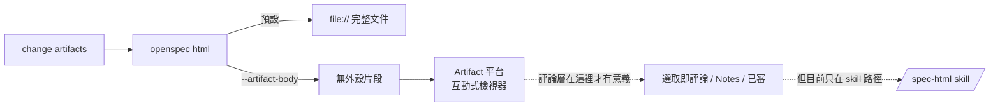

# port-comment-layer-to-cli — Design

## Context

評論層目前只在 skill 那條路徑，且 CLI 明文把它列為 Non-Goal：

| 位置 | 內容 |
|------|------|
| `odoo-claude-code/deploy/templates/html/skeleton.html` | 評論層 CSS（L418 起）／HTML（L601、L869）／獨立 IIFE script（L990 起），三段合計約 1,200+ 行 |
| 同上 `conventions.md` L838 起 | 「評論層（spec-comment-*）」章節：單一區塊驗證、sectionTitle 排除已審 checkbox、刪除時的巢狀 mark 重建、Notes 面板與 localStorage 持久化、依 sink 各自決定跳脫 |
| `openspec-fork/src/core/render/html-template.ts` 檔頭 | 明文寫「評論層是 CLI renderer 的 Non-Goal，因為它依賴 localStorage／selection API，只在互動式 Artifact 檢視器裡有意義」 |

那段理由被 change `html-viewer-markdown-artifact-mode` 推翻——CLI 的 `--artifact-body` 產出現在正是發佈到互動式 Artifact 檢視器。

## Goals / Non-Goals

**Goals:**
- CLI 產出的 viewer 具備選取即評論、Notes 面板、已審勾選、匯出。
- 分域可靠：不同 change 的註記互不污染，且不依賴脆弱的 `<title>` 解析。
- 確定性與既有導覽零回歸；評論層仍可整段移除。

**Non-Goals:**
- 不做免貼上的評論回讀（notes 自動送回 Claude）→ vault TODO **T-183**。
- 不做跨裝置同步（`localStorage` 綁 origin，既有邊界）。
- 不動 `/spec-html` skill 的評論層。
- 不改 markdown 渲染、輸出模式、落點政策。

## Decisions

### Decision 1: 分域改讀 `data-change-name`，不解析 `<title>`
**Covers**: `html-viewer-command`

skill 版的 `detectChangeName()` 從 `document.title` 找 `<change-name> · spec-viewer` marker，找不到就**強制 in-memory**（刻意的：避免所有缺 marker 的頁面共用一把 key 互相污染彼此的評論）。

CLI 版改成：renderer 在內容根元素輸出 `data-change-name="<change-name>"`，script 讀它。

**Rationale**：兩個理由。①**片段模式沒有 `<head>`／`<title>` 可放**，發佈後的 `document.title` 由平台決定，不在 renderer 掌握中——把持久化的正確性押在別人設定的標題上是不必要的風險。②CLI **在渲染時就知道** change 名（它是 `renderChangeHtml` 的參數），沒有理由繞一圈從標題反推。skill 版之所以那樣做，是因為那份 HTML 由 model 寫、沒有可靠的注入點。

「缺席即 in-memory、絕不落到固定 fallback key」這條保護**保留**——只是判斷依據從 title marker 換成 `data-change-name`。

**Rejected**：
- **沿用 `<title>` 解析** — 片段模式下等於把分域交給平台的標題邏輯；平台若改變標題格式，全部 viewer 靜默退化成 in-memory（而且沒人會注意到）。
- **把 change 名寫進 script 常數字面值** — 會讓 script 段不再是常數、每個 change 產出不同 script 文字，且與「呈現構件是常數」的既有結構衝突（`data-` 屬性放在 HTML 段更自然）。

### Decision 2: 移植（re-declare）而非跨 repo 引用
**Covers**: `html-viewer-command`

三段構件在 `src/core/render/comment-layer.ts` 重新宣告為 TS 常數，與 `SPEC_VIEWER_STYLE`／`SPEC_VIEWER_NAV_SCRIPT` 同樣的處理。

**Rationale**：這個 fork 的既有約束是 render 時 self-contained、不跨 repo 參照（`html-template.ts` 檔頭已記錄此 sync discipline 與其代價）。評論層沒有理由破例。漂移由本 repo 的 fixture／確定性測試 + 人工同步接住，與樣式那一段同一套辦法。

**Rejected**：
- **build 時從 `odoo-claude-code` 讀 skeleton.html** — 建立跨 repo build 依賴，CI 與 npm 安裝情境都拿不到那個路徑。
- **抽成共用 npm 套件** — 為兩個消費者建一條發佈鏈，成本遠大於收益。

**Directive**：改動 `odoo-claude-code` 的評論層時，這裡要人工同步；兩邊的行為契約以本 change 的 spec 為準，不要只改一邊就當完成。

### Decision 3: 兩種模式都含評論層
**Covers**: `html-viewer-command`

不做「只有 artifact 模式才有」的分支。

**Rationale**：前一個 change 立的原則是**單一內容產生器**，兩模式只差有無外殼——加一個功能分支就會出現「某模式少了某段」這類只在一條路徑現形的 bug。`file://` 下 `localStorage` 可能不可用，但評論層**本來就有** in-memory 降級與明示提醒，那條路徑照用即可，不需要為它另闢設計。

**Rejected**：**只在 artifact 模式輸出** — 省下的體積換來一條分岔的覆蓋面，不值得。

### Decision 4: 匯出維持 clipboard + modal fallback
**Covers**: `html-viewer-command`

**Rationale**：免貼上的回讀（T-183）需要 capability 側配合，屬另一條線；在它落地前，clipboard 是實際可用的最短路徑，modal fallback 保證剪貼簿被拒時不會靜默失敗。

## Risks / Trade-offs

| 風險 | 評估 | 緩解 |
|------|------|------|
| **評論層是新增的最大攻擊面**——使用者輸入的評論文字要寫回 DOM | **本 change 最需要盯的地方**；與 markdown generator 同級 | 沿用 conventions「依 sink 各自決定跳脫」：DOM 走文字節點／entity 跳脫、Markdown 匯出走 Markdown 轉義；測試 MUST 含評論文字注入 payload 並以結構審計（掃實際產生的標籤／屬性）驗證，而非文字比對 |
| 移植 1,200+ 行後與 skill 版漂移 | 中——兩份實作、人工同步 | Decision 2 的 Directive；行為契約集中在本 change 的 spec，兩邊都以它為準 |
| 產出檔明顯變大（片段目前約 68KB） | 低——純文字、無外部資源、不入版控 | 不緩解 |
| 選取／`Range` 操作破壞既有 DOM，連帶弄壞導覽 | 中——標記會改動內文 DOM | spec 明列可分離性與「不共用變數／不改 revealTarget」；測試 MUST 驗「移除評論層後導覽仍運作」與「加/刪註記後 scrollspy 目標仍可命中」 |
| Artifact redeploy 後註記是否保留 | 低——同 URL 同 origin，`localStorage` 應保留；但 change 改名等於換 key | 實機驗一次 redeploy 後註記仍在；spec 只保證同 change 名 |
| 巢狀標記刪除的還原邏輯（skill 版有 review-fix P2c 專門處理） | 中——已知易錯處 | 移植時連同該修正一起帶；測試 MUST 含巢狀標記刪除還原 |
