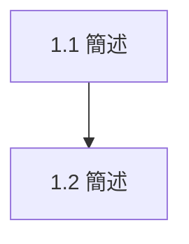

## P0（CRITICAL）

- [ ] 1.1 <!-- 任務描述 --> — `<!-- path/to/file -->`
- [ ] 1.2 <!-- 任務描述 --> — `<!-- path/to/file -->`

## P1（HIGH）

- [ ] 2.1 <!-- 任務描述 --> — `<!-- path/to/file -->`
- [ ] 2.2 <!-- 任務描述 --> — `<!-- path/to/file -->`

## P2（MEDIUM）

- [ ] 3.1 <!-- 任務描述 --> — `<!-- path/to/file -->`

## 依賴圖

## BUG-FIX 追蹤

_（實作階段發現的 bug 在此記錄）_

| 狀態 | 說明 | 檔案 |
|------|------|------|
