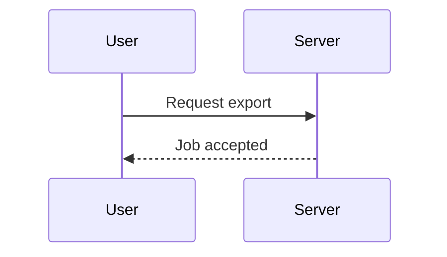

# Design: complete-change

## Context

The export flow needs a background job so large widget sets don't block the request.

## Decisions

### Decision 1: Use a queue

## Risks / Trade-offs

- [Risk] Large exports may time out → Mitigation: chunked processing.
